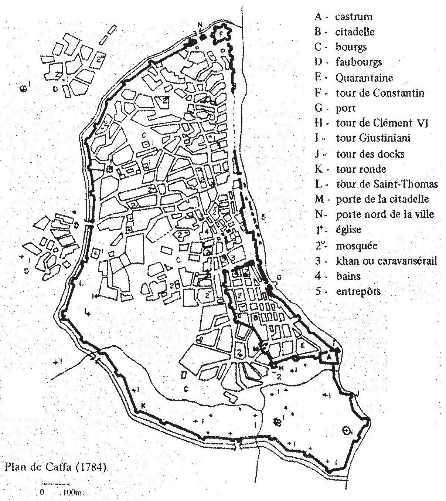
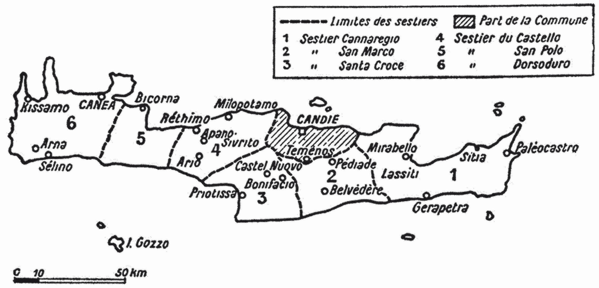

Deux républiques maritimes italiennes ont constitué un réseau de comptoirs et de colonies en Méditerranée orientale à la fin du Moyen Âge: [Gênes](http://www.genoesemerchantnetworks.com/s/main/item/26037) et [Venise](http://www.genoesemerchantnetworks.com/s/main/item/26148). En effet, l’expansion des deux autres républiques maritimes, Amalfi et Pise, a tourné court. Amalfi, après avoir noué des liens intenses avec Byzance, dès le Xe siècle, et avec la Syrie-Palestine, où ses marchands avaient fondé à Jérusalem un hospice pour les pèlerins, a été conquise par les Normands à la fin du XIe siècle, puis ravagée par la flotte pisane dès les années 1130.[^1] Formant de petites communautés marchandes dans le royaume normand de Sicile, les Amalfitains n’ont plus guère fréquenté l’est de la Méditerranée. Quant à Pise, elle avait obtenu du roi de Jérusalem un quartier à Acre, du *basileus* Alexis 1er Comnène un quartier à Constantinople, mais, vaincue par les Génois à la bataille de la Meloria en 1284, la ville dut renoncer à toute expansion outre-mer.[^2]

Restent donc en présence [Venise](http://www.genoesemerchantnetworks.com/s/main/item/26148) et [Gênes](http://www.genoesemerchantnetworks.com/s/main/item/26037), si l’on excepte le cas des Catalans qui ont créé l’éphémère duché d’Athènes au XIVe siècle, duché qu’ils n’ont pu conserver au-delà des années 1380.[^3] Où se situent les domaines coloniaux des deux puissances dominantes?

# Les domaines coloniaux vénitiens

Dans la mesure où ils ont été longtemps considérés comme des sujets de l’empire byzantin, les Vénitiens ont formé très tôt une communauté à Constantinople: dès 944, ils sont cités pour leur soutien à Constantin VII Porphyrogénète, lorsque sont écartés du pouvoir Romain Lécapène et ses fils. L’appui maritime que les Vénitiens apportent à Alexis 1er Comnène contre les Normands leur vaut en 1082 l’attribution d’un quartier sur les rives de la Corne d’Or, ainsi que des privilèges commerciaux et honorifiques.[^4] Ils obtiennent des agrandissements successifs de leur comptoir au cours du XIIe siècle, en particulier grâce au chrysobulle de 1198 qui leur ouvre également l’accès des plus importants ports de l’Empire. Les succès de la Quatrième Croisade offrent à [Venise](http://www.genoesemerchantnetworks.com/s/main/item/26148) la domination des trois huitièmes de Constantinople et du nouvel empire latin qui se maintient jusqu’en 1261. Chassés alors de la capitale byzantine reprise par les troupes de Michel VIII Paléologue, les Vénitiens y font un retour modeste en 1268 et s’y maintiennent en dépit d’une guerre larvée avec Byzance et les Génois, ne reprenant des relations pacifiées avec l’Empire qu’à partir de 1324. Ils conservent leur quartier constantinopolitain, jusqu’à la prise de la capitale byzantine par les Ottomans.[^5]

Trois autres ensembles géographiques accueillent des communautés marchandes vénitiennes. Maîtres de Constantinople en 1204, les Vénitiens ont accès à la mer Noire où ils vont fonder dans la première moitié du XIIIe siècle un petit comptoir à Soldaïa sur la côte de Crimée.[^6] Les frères Polo y passent en 1260, mais constatant la longueur des affaires ils poursuivent leur chemin jusqu’en Chine.[^7] L’importance de la route mongole de la soie et des épices est telle au début du XIVe siècle que les Vénitiens installent à Tana en 1311 un comptoir voisin de celui des Génois.[^8] À Trébizonde, au débouché de l’autre route mongole venant de l’Il-khanat de Perse, les Grands Comnènes leur concèdent également un quartier, de sorte que la mer Noire devient dès la seconde moitié du XIIIe siècle le champ d’affrontement entre Gênes et Venise pour la domination des circuits du grand commerce.[^9]

Dans le monde égéen, l’expansion vénitienne est la conséquence de la Quatrième Croisade. Incapable d’occuper la Crète qui lui était échue lors du partage de l’empire byzantin, Boniface de Montferrat vend l’île à la Sérénissime, qui s’efforce de la peupler en créant des “chevaleries” et des “sergenteries” attribuées à des colons qui se répartissent dans les six sestiers entre lesquels l’administration de la Crète est divisée. Venise gouverne l’île d’une main ferme, en dépit des révoltes fomentées par les archontes grecs, parfois soutenus par des nobles vénitiens se rebellant contre les exigences fiscales et économiques de la métropole.[^10] Au sud du Péloponnèse, Venise a acquis Coron et Modon, deux places fortes surveillant les mouvements de navires entre la mer Ionienne et la mer Égée.[^11] Elle exerce une influence dominante sur Nègrepont, acquiert Corfou en 1385 et Nauplie en 1388, occupe temporairement Thessalonique avant la prise de la ville par les Turcs en 1430, de sorte que tout l’ouest de la mer Égée est sous la domination de Venise.[^12]

En Méditerranée orientale, la création des comptoirs vénitiens est liée aux croisades. En Terre sainte, en récompense de l’aide navale apportée lors de la conquête de Tyr, Venise reçoit par le *pactum Warmundi* de 1123 un tiers de la ville de Tyr, un quartier à Acre et des exemptions de taxes douanières.[^13] En Égypte, peu de temps avant 1173, mais postérieurement aux Pisans, les Vénitiens se voient concéder un *funduq*, comportant entrepôts et logements pour les marchands, qui restent néanmoins sous l’autorité califale.[^14] Dès les premiers temps du gouvernement des Lusignan en Chypre, des marchands vénitiens viennent commercer à Limassol et à Paphos, mais il faut attendre 1306 pour qu’un premier privilège sanctionne les droits des Vénitiens dans les principaux ports de l’île. Famagouste devient à la fin du XIIIe siècle le principal refuge des rescapés de Terre sainte, le “rendez-vous de toutes les nations d’Occident”. Les Lusignan favorisent Venise dans la première moitié du XIVe siècle, au détriment des Génois, mais un incident lors des fêtes du couronnement de Pierre II en 1372 provoque l’arrivée d’une flotte génoise qui s’empare de Famagouste et ne laisse aux Vénitiens que des terres autour de Paphos, où prospère la culture de la canne à sucre sur les biens de la famille Corner.[^15]

Venise a donc construit entre le XIe et le XIVe siècle un réseau étendu de comptoirs, plus propices à une activité marchande qu’à une véritable colonisation agricole, à l’exception de la Crète, grenier à blé de la Sérénissime.

# Les domaines coloniaux génois

L’expansion génoise en Méditerranée orientale est un peu plus tardive que celle des Vénitiens. Quelques marchands fréquentent l’Égypte dès l’avènement des Fatimides en 969, mais il faut attendre 1200 pour que la concession d’un *funduq* particulier favorise l’installation d’une petite communauté à Alexandrie. En Syrie-Palestine, en revanche, l’implantation des Génois est précoce et massive. Grâce à l’aide navale qu’ils fournissent aux croisés dès le siège d’Antioche, ils obtiennent la concession de quartiers à Antioche, Tripoli, Acre, Tyr et Gibelet, ainsi que des exemptions des taxes douanières. Ils entrent en concurrence avec Pisans et Vénitiens, sont chassés d’Acre en 1256-58 lors de la guerre de Saint-Sabas, qui oppose entre elles les communautés italiennes, mais trouvent refuge à Tyr jusqu’à la chute des États latins en 1291.[^16] Dans le royaume de Chypre, les Génois reçoivent en 1218 leurs premiers privilèges, qui sont confirmés en 1232 par le roi Henri Ier. Installés dans les principaux ports de l’île, ils y prospèrent, malgré des tensions avec les Lusignan dans la première moitié du XIVe siècle. En 1373, l’expédition de Pietro di Campofregoso, vengeant les affronts subis l’année précédente lors des fêtes du couronnement de Pierre II, leur livre Famagouste et assujettit la monarchie chypriote au versement de lourdes indemnités. Gênes cherche vainement à imposer un monopole du trafic au profit de sa conquête, mais la ville est reprise par les troupes de Jacques II en 1464.[^17]

À Constantinople, les Génois arrivent bien longtemps après les Vénitiens et les Pisans. Manuel Comnène, recherchant leur alliance pour ses projets de reconquête en Italie, leur accorde un premier chrysobulle en 1155, en leur concédant un quartier dans la capitale et une réduction du taux du *kommerkion*. L’hostilité de leurs concurrents et la xénophobie des Grecs (émeute anti-occidentale de 1182) freine l’essor de leur comptoir constantinopolitain, agrandi toutefois en 1202. Les Génois ne participent pas à la Quatrième Croisade et perdent en 1204 leur quartier dans la capitale. Leur alliance avec Michel VIII Paléologue (traité de Nymphée en 1261) leur permet de s’établir au nord de la Corne d’Or, dans le quartier de Péra qui peu à peu va constituer un État dans l’État byzantin et demeure le centre de leurs affaires en Romanie jusqu’à la chute de Constantinople en 1453.[^18]

L’installation à Péra facilite l’accès à la mer Noire. Après 1261, celle-ci devient une mer génoise. Sur la côte de Crimée, les marchands s’installent sur le site d’une antique colonie grecque, Theodosia, et fondent Caffa entre 1270 et 1275. Les premiers développements du comptoir sont interrompus par des raids mongols. En 1316, les autorités génoises organisent la reconstruction systématique de la ville qui s’entoure de murailles et peut résister aux Tatars en 1344 et 1346. D’autres comptoirs sont fondés à la fin du XIIIe siècle aux bouches du Danube (Vicina, Kilia-Licostomo, Moncastro), à celles du Don (La Tana dans les années 1280), tandis que les Génois élargissent leur emprise sur la côte criméenne, en s’emparant de Cembalo en 1340 et de Soldaïa en 1365. Sur la côte septentrionale de l’Anatolie, les Génois obtiennent des Grands Comnènes un comptoir à Trébizonde et en fondent trois autres à Samastri, Sinope et Simisso. L’ensemble de la zone pontique passe sous influence génoise, malgré l’énergique résistance de Venise, lors de trois guerres “coloniales” au cours du XIVe siècle.[^19]

Dans le monde égéen, les Génois cherchent à dominer des lieux d’escales favorisées sur les routes du grand commerce entre l’Occident et la mer Noire, ou entre Constantinople et l’Égypte. L’amiral Benedetto Zaccaria construit sa fortune sur l’exploitation de l’alun de Phocée, ville d’Asie mineure qui lui est concédée en 1264 par Michel VIII Paléologue, puis, pour assurer la sécurité des transports maritimes de l’alun, il reçoit d’Andronic II la concession de Chio. Les maladresses de ses successeurs provoquent le retour de ces deux possessions à l’Empire. Mais en 1346, profitant des querelles dynastiques à Byzance, Gênes envoie en Orient l’expédition conduite par Simone Vignoso, qui occupe Chio et Phocée. Les armateurs qui la composent forment la Mahone de Chio qui, tout en reconnaissant la souveraineté de Gênes, administre Chio et Phocée, en perçoit les revenus distribués proportionnellement à l’apport de chacun de ses membres. Plus au nord, la famille génoise des Gattilusio reçoit en 1355 la concession de Mytilène et étend sa domination sur les îles du nord de la mer Égée, Imbros, Thasos et Samothrace.[^20] Ainsi toute la partie orientale de la mer Égée passe sous le contrôle de Gênes qui entend conserver le libre passage par les Détroits vers Constantinople et la mer Noire. La concession par Andronic IV à Venise de l’île de Ténédos, qui commande l’entrée des Dardanelles, provoque la guerre de Chioggia. Phocée tombe en 1455 au pouvoir des Turcs; il en est de même des possessions des Gattilusio, prises entre 1456 et 1462. Seule Chio, pont jeté entre la chrétienté et l’Anatolie ottomane, demeure au pouvoir de la Mahone génoise jusqu’en 1566.[^21]

Les sources d’information sur les sociétés coloniales génoises et vénitiennes sont désormais assez bien connues. Nous illustrerons ci-après deux domaines, les territoires pontiques pour Gênes, la Crète pour Venise.

# Caffa, le fleuron génois

Caffa sur la côte de Crimée a constitué pendant deux siècles le fleuron des possessions génoises en mer Noire. Sa fondation est entourée d’un certain mystère. Bénéficiant de l’accès à la mer Noire grâce à leur installation à Péra, les Génois fréquentent d’abord le comptoir vénitien de Soldaïa, où leur présence est attestée en 1274, puis, gênés par la concurrence vénitienne, ils obtiennent du khan mongol vers 1275 l’autorisation de s’installer sur le site d’une antique colonie grecque, quasi désertée, Theodosia, désormais dénommée Caffa. L’essor de la communauté génoise dut y être rapide, puisqu’un consul y est mentionné dès 1281 et que les actes du notaire Lamberto di Sambuceto (1289-1290)[^22] font apparaître une colonie prospère ayant d’intenses liens commerciaux avec Tana, Trébizonde, Constantinople, aussi bien qu’avec l’Occident. Ce premier essor est anéanti en 1307, lorsque les armées du khan mongol Tohtu viennent assiéger le comptoir. La disproportion des forces contraint les Génois à abandonner la ville, non sans y mettre le feu. Cinq ans plus tard, une ambassade envoyée auprès du successeur de Tohtu, Özbek, obtient le retour des Génois sur le site. L’année suivante, la Commune de Gênes instaure une commission de huit sages, l’*Officium Gazarie*, pour s’occuper des problèmes de la navigation et de la mer Noire.[^23] Le 18 mars 1316, est publié l’*ordo de Caffa*, un ensemble de dispositions réglant la reconstruction du comptoir génois, et, un peu plus tard, l’*Officium* adresse dans le même sens des instructions au consul de Caffa.[^24]

Le texte de l’*ordo* est un véritable plan d’urbanisme. Il comporte tout un ensemble de dispositions techniques pour structurer la ville renaissante et donne par là même des informations sur la population et la société qui s’y réinstallent.

Les autorités génoises se préoccupent d’abord de réquisitionner les terres se situant à l’intérieur de la citadelle; les édifices qui y avaient été construits, malgré les interdits prononcés par les syndics de la Commune, seront détruits et les terres vendues par lots aux enchères. Font exception l’espace concédé à l’église et au couvent des frères mineurs, celui concédé à l’hôpital, deux églises des Arméniens et deux églises des Grecs, ainsi que l’espace réservé aux frères prêcheurs. De même, les terres situées à l’extérieur des murs de Caffa, mais à l’intérieur des limites de la ville, seront réquisitionnées, à l’exception de celles où se trouvent les églises des Grecs, des Arméniens et des Russes, ainsi que les ermitages rattachés à ces églises. Cette disposition montre la prudence des autorités génoises dans leurs rapports avec les groupes ethniques installés depuis longtemps. Les terres ainsi libérées seront louées *ad libellum*, c’est-à-dire par contrat à long terme. Un espace libre de cent coudées sera aménagé autour des murs de Caffa, au-delà du fossé qui les entoure, dans un souci de défense bien compréhensible. Le revenu de ces locations pourra être dépensé chaque année pour le bien de la ville, sur décision des trois quarts des vingt-quatre conseillers du consul. Une autre disposition du texte prévoit de laisser libres les terres se trouvant hors les murs de Caffa, du côté de la route menant à Solgat, pour les besoins du bazar des approvisionnements. Enfin, un abattoir sera construit en bord de mer, devant le *funduq* de la Commune; les revenus locatifs qui en seront tirés serviront au paiement des frais de construction de l’édifice.

Ce texte, fort original dans la documentation génoise concernant l’outremer, souligne deux aspects de la colonie renaissante. D’une part, la grande diversité ethnique de la population qui, en dehors des Latins immigrés, fait une large place aux Grecs, aux Arméniens et aux Russes, dont les autorités génoises veulent respecter les traditions et les édifices cultuels.[^25] Elles se préoccupent aussi de favoriser l’implantation des ordres mendiants, précoce en Crimée où les frères ont suivi de très près les marchands. Caffa va devenir ainsi un centre de rayonnement du christianisme en pays mongol. D’autre part, l’*ordo de Caffa* fournit d’importants renseignements d’urbanisme. Il sous-entend l’existence de monuments antérieurs à l’installation des Génois: les églises des indigènes, un palais, un bain. Il souligne aussi un effort d’organisation rationnelle de l’espace, par le biais de lotissements, par les délais de construction limités à quatre ans sur les lots attribués, par une certaine séparation entre Occidentaux et indigènes, dont la réalité est en partie démentie par la documentation notariale, bien que la citadelle (le *castrum*) soit plutôt occupée par des Latins au cours du XIVe siècle et les bourgs de Caffa par les communautés indigènes.

Les actes notariés instrumentés outre-mer apportent une riche documentation sur la société coloniale. Il en est ainsi du testament de Giorgio di Gavi, un Ligure émigré à Caffa.[^26] Le 7 août 1290, devant les cinq témoins que requiert la rédaction d’un testament, le malade dicte ses dernières volontés au notaire Lamberto di Sambuceto. La structure du texte est classique: des formules initiales soulignent que le malade est sain d’esprit et met son espérance dans le salut de son âme. Suivent l’énumération des legs, des créances à recouvrer et des dettes à payer, la désignation des héritiers et des fidéicommissaires avec leurs pouvoirs respectifs, puis les dates topique et chronologique, enfin la liste des témoins. Le notaire, Lamberto di Sambuceto, illustre par ses actes bien des aspects de la société coloniale. Après avoir instrumenté à Gênes, il est arrivé à Caffa en 1288, y réside au moins jusqu’en août 1290, puis passe en Chypre, où l’on suit son activité de 1296 à 1307. Il revient à Gênes et achève son existence en 1325, à en juger par son propre testament, dicté le 12 mars de cette même année.[^27] Quant au malade, Giorgio di Gavi, il provient d’un petit village de l’Apennin au nord de Gênes et a participé à ce vaste mouvement d’*inurbamento*, attirant vers la métropole ligure une partie de la population du *contado*. La présence de ce personnage à Caffa illustre l’ampleur d’une émigration vers l’outre-mer qui touche toute la Ligurie, les *Riviere* aussi bien que l’intérieur.

Le testateur choisit d’abord le lieu de sa sépulture, l’église des frères mineurs de Caffa, un choix soulignant l’attrait pour l’intercession des frères qui reçoivent des legs pour dire des messes et pour l’œuvre de leur église. L’hospice Saint-Jean de Caffa, qui porte le nom du saint patron de Gênes, est aussi bénéficiaire de legs. Les familiers ne sont pas oubliés. L’épouse de Giorgio gardera ses vêtements, ses affaires et la résidence occupée par le couple, à condition toutefois qu’elle ne se remarie pas. Elle reste tutrice de ses enfants. Alors que beaucoup d’émigrés ont laissé en Ligurie épouse et enfants pour former outre-mer une communauté d’hommes, la présence à Caffa de l’épouse du testateur dénote le début de la formation d’une société coloniale stable. Giorgio se préoccupe de liquider les affaires de sa mère et de son grand-père, accorde cent livres à sa sœur Petrina, 152 aspres baricats, petite monnaie d’argent de Caffa, et des vêtements à son serviteur Guglielmo, et 100 aspres à sa servante, Marie. La liste des créances montre les liens d’affaires établis avec des représentants des grandes familles génoises, les Salvaigo, Lomellini et de Camilla. Au total, Giorgio di Gavi doit recouvrer 16 350 aspres et 71 hyperpères; il rappelle qu’il a envoyé à Gênes une cargaison de près de deux tonnes de cire. Ce bilan situe le testateur parmi les hommes d’affaires les plus éminents de la colonie génoise. Le testament s’achève par la désignation des héritiers, les quatre fils de Giorgio, et de deux fidéicommissaires, dont l’un n’est autre que le principal associé en affaires du testateur, Porcheto Salvaigo. L’acte est instrumenté dans le *funduq* d’un Syrien en présence de cinq témoins: un notaire, un membre de la noblesse vicomtale et trois autres personnes.

Le testament de Giorgi di Gavi nous paraît emblématique du prodigieux développement d’une société coloniale, à peine quinze ans depuis la fondation de Caffa. Il montre en effet l’ampleur de l’émigration outre-mer qui touche aussi bien l’aristocratie marchande de Gênes que les membres du *popolo minuto*. Les uns et les autres ont fait en quelques années la prospérité du comptoir génois et ont acquis de gros moyens par l’exercice d’activités commerciales dirigées vers toutes les places pontiques, Constantinople et l’Occident. Les indigènes y ont une part réduite, se contentant de rabattre vers Caffa les denrées alimentaires et les matières premières des régions bordières de la mer, marchandises qui sont ensuite exportées sous la direction des hommes d’affaires occidentaux.

# La Crète vénitienne

En est-il différemment en Crète vénitienne ? L’île achetée par Venise à Boniface de Montferrat pour la somme de 1000 marcs d’argent, a subi la résistance des Génois, soutenant les groupes armés par le comte de Malte, Enrico Pescatore jusqu’en 1212 et Alamanno da Costa jusqu’en 1217. En septembre 1211 le Sénat organise une colonisation militaire de la Crète en publiant la *Concessio Crete*. Le texte répartit les terres confisquées à l’Église et aux archontes grecs en 132 “chevaleries” et 48 “sergenteries” confiées à des citoyens vénitiens. D’autres contingents sont envoyés peupler l’île en 1222, 1233 et 1252, de sorte qu’au début du XIVe siècle le nombre de lots de colons s’élevait à 587. D’après les actes notariés et les décisions du Sénat, l’organisation administrative repose sur un duc de Crète nommé pour deux ans par le Grand Conseil, assisté d’une nombreuse suite de notaires, de secrétaires et d’employés, et d’un conseil des feudataires. Un capitaine général assure le commandement des troupes et veille à la défense de l’île. Deux camerlingues sont responsables des finances et des châtelains et recteurs sont établis dans les villes principales, en dehors de Candie, La Canée, Rethimno et Sithia.[^28] Une disposition du Sénat limite les déplacements des châtelains, dans un souci de sécurité (texte 2e). Pour faire face à la dépopulation de l’île, le Sénat décide de favoriser l’immigration d’esclaves et d’accorder, pour ce faire, des prêts aux importateurs (texte 2a).

Le Sénat se préoccupe aussi de l’essor économique de l’île qui fournit à la métropole une part importante de ses approvisionnements en grain et en vin. Giacomo Querini, représentant de la noblesse ancienne de Venise et sans doute titulaire d’une chevalerie crétoise, fait exploiter ses terres par des Grecs dans le cadre du casal qui correspond au village byzantin, le *chôrion* (texte 1b). La location porte sur deux types de terres. S’il s’agit d’une terre arable, le contrat prévoit une concession de longue durée *in gonico*. Querini concède à ses tenanciers une paire de bœufs et exige le paiement d’un cens en nature, froment et orge. Pour la vigne, la location est plus onéreuse, puisqu’elle représente la moitié de la récolte et fait obligation au paysan de valoriser le fonds qui lui a été confié. Le Sénat a aussi essayé d’aider Marco de Zanono dans son effort pour implanter en Crète la culture de la canne à sucre, mais la concurrence de Chypre et de la Sicile mit rapidement un terme à cet essai.[^29] La Crète est aussi terre d’élevage, comme l’atteste la société conclue entre deux Vénitiens, Giacomo Piloso et Raffaele Vitale, pour l’entretien d’un troupeau de moutons, les gains étant partagés entre les deux associés, dans la mesure où Raffaele, sans doute débiteur de Giacomo, prend en charge la garde du troupeau (texte 1a).[^30]

Les actes notariés soulignent aussi le rôle central de la Crète dans les navigations vénitiennes vers la Méditerranée orientale, d’autant que depuis l’occupation génoise de Famagouste les Vénitiens évitent l’escale chypriote pour leurs convois ou *mude* à destination d’Alexandrie et de Beyrouth. Les chargements d’épices, de coton et de soie envoyés à la Sérénissime sont compensés par l’importation de draps français et de futaines de Lombardie, pour lesquels se met en place un système d’achats à crédit (texte 1c).[^31]

Les relations entre Grecs et Latins dans le cadre insulaire sont marquées par la méfiance des autorités envers les Grecs qui ne peuvent être feudataires, afin que les services militaires soient parfaitement rendus par les tenanciers de “chevaleries” (texte 2b). Cette méfiance est justifiée par le grand nombre de révoltes qui ont secoué l’île, par exemple celle de Kalergis entre 1293 et 1299, ou celle de San Tito (1363-1366), au cours de laquelle des feudataires vénitiens, excédés des exigences économiques et fiscales de la métropole, ont pris fait et cause avec les insurgés grecs et ont subi avec eux les châtiments d’une rude répression.[^32] Les relations avec l’orthodoxie ne sont pas faciles, car la conquête vénitienne du XIIIe siècle a chassé de l’île le métropolite de Crète, remplacé par un protopappate qui doit se faire consacrer hors du domaine vénitien. Aussi les autorités recherchent-elles un candidat qui soit “fidèle à notre État” et non un “propagandiste de toute hérésie” qui viendrait semer le trouble dans les relations entre les deux communautés (texte 2 c). Il n’en reste pas moins que les actes notariés instrumentés dans l’île mettent en évidence les rapprochements entre Grecs et Latins dans la vie quotidienne, dans les affaires et jusque dans l’intimité des familles.[^33]

Les sources gouvernementales et littéraires vénitiennes soulignent la rigidité du contrôle exercé par le Sénat sur le gouvernement de l’île de Crète et sur l’exploitation des ressources insulaires. Elles ignorent le fait que les feudataires et les gens du commun ont absorbé une part de la culture grecque, noms, langage et coutumes, et toléré dans l’ensemble l’exercice du culte orthodoxe, comme le révèlent les documents notariés, plus proches de la réalité sociale.[^34] L’attitude des autorités génoises apparaît plus souple et plus tolérante, après la répression de quelques révoltes dans les premiers temps de l’administration de Chio ou lors des affrontements avec les Mongols à Caffa. Mais dans les deux domaines coloniaux examinés, la société n’est en rien une société d’apartheid. Les membres de plusieurs communautés cohabitent, concluent des contrats devant notaire en se passant d’interprète, signe que les échanges linguistiques ont progressé et abouti à la formation d’une *lingua franca* outre-mer. Dans les couches supérieures des sociétés crétoise et pérote le mariage de notables latins avec des femmes indigènes n’est pas une exception, comme le montre le cas des Kalergis en Crète, des Demerode et des de Draperiis à Péra. Les mariages mixtes et les concubinages dans les strates inférieures de la société sont encore plus fréquents. La seule source de friction vient du problème religieux, particulièrement en Crète, alors que les autorités génoises d’outre-mer n’ont jamais favorisé le prosélytisme des clercs latins et ont au contraire laissé libre l’exercice des cultes non-catholiques. Dans les sociétés coloniales de la fin du Moyen Âge, l’homogénéité ethnique est un mythe démenti par les sources de la pratique.

# Annex

## Appendice documentaire

### Un testament de Caffa génoise (1290)

(Michel Balard, *Gênes et l’Outre-Mer...*, *op. cit.*, p. 365-367 [ASG, NA 42/I, fol. 183r–v])

7 août 1290. *Georgius de Gavio fait rédiger son testament. II désire être enterré en l’église Saint-François de Caffa. II accorde plusieurs legs, dresse la liste de ses créances, et nomme héritiers ses fils Franciscus, Rizardinus, Acellinus et Manuel.*

***

In nomine domini amen ego Georgius de Gavio, sane mentis existens, licet eger corporis, timens divinum iudicium cuius nescitur hora, nuncupative testari cupiens contemplacionis mee ultime voluntatis, de me et meis talem facio disposicionem.

In primis, si me mori contigerit, elligo me sepelliri debere apud ecclesiam sancti Francisci fratrum minorum de Caffa, cui ecclesie lego, pro sepultura et exequiis funeris mei, asperos ducentos barichatos.

Item lego pro missis canendis asperos centum barichatos.

Item operi dicte ecclesie asperos centum.

Item hospitali sancti Iohanis de Caffa asperos centum.

Item lego Iacobe uxori mee, ultra raciones suas, totum asnisium pertinens ad suum dorssum cum sospitali.

Item volo et iubeo quod si restaret aliquid ad solvendum, pro eo quod solvere debebam pro anima matris mee, quod omne id et totum, quod restaret, solvatur de bonis meis.

Item lego, pro remedio anime mee, libras sexaginta Ianuinorum in distribucione Leonis de Gavio, avunculi mei.

Item volo et iubeo quod si restaret aliquid ad solvendum in testamento avii mei ex linea paterna, quod solvere debuisset dictus pater meus, pro dicto avio meo, aliquid, quod omne id et totum solvatur, et solvere debeat de bonis meis.

Item lego Petrine, sorori mee, libras centum Ianuinorum.

Item lego Guillielmo, famulo meo, pro capitale et lucrum cuiusdam accomendacionis yperperorum octo auri, quos habeo ab eo, asperos centum quinquaginta duos barichatos, bonos et expendibiles de Caffa.

Item lego dicto famulo meo, pro eius fatica sive mercede, asperos centum barichatos, tunicam, ciprisium et exantellinum blavi pro dorsso meo.

Item lego Marie, serviciali mee, pro eius servicio et fatica, asperos centum barichatos.

Ut infra confiteor me recipere debere a personis infrascriptis: primo a Porcheto Salvaigo, ibidem presente et confitente, asperos quinquemillia septingentos quinquaginta barichatos.

Item dedi in custodia eidem Porcheto in duobus sachetis, sigillatis sigillo meo, asperos decemmillia barichatos, vel circa.

Item a Francisco Lomellino asperos quingentos barichatos.

Item a Precivale de Camilla yperperos septuaginta unum auri veteres, dare et solvere debeo eidem Precivalli quicquid voluerit de scoto.

Item a Luchino Marzono asperos centum barichatos, de quibus debet habere pro penssione domus asperos quinquaginta barichatos.

Item confiteor me misisse Ianuam milliaria quinque et dimidia cere, proiecte in panibus, que confiteor esse de mea comuni racione, quam extraxi de Ianua, et de quibus est instrumentum.

Reliquorum bonorum meorum, mobilium et immobilium, michi heredes instituo equaliter filios meos, videlicet Franciscum, Rizardinum, Acellinum et Manuelem, et si alter dictorum filiorum meorum, absque legittimo herede ex se nato, decederet infra etatem annorum decem et novem, quod alter alteri succedat usque in dictam etatem; et si forte dicta uxor mea vellit permanere in domo mea, absque viro cum dictis filiis meis, lego quod ipsa, una cum Leone de Gavio, sit tutrix sive curatrix dictorum filiorum meorum, et ultra sit dona et domina domus, et aliter non; et dictus Leo permanere sive remanere debeat tutorem sive curatorem dictorum filiorum meorum.

Item facio, constituo et ordino de omnibus bonis meis, quos habeo et michi debentur in Caffa et tota Gazaria, ac eciam imperio Romanie, meos fideicommissarios Franceschinum Bonifacium et Porchetum Salvaigum, presentes, volentes et suscipientes, et quemlibet eorum insolidum, ita quod non sit melior condicio occupantis, et quod unus inceperit, alter finire possit, ad habendum, petendum, exigendum et recipiendum quicquid et quantum invenire... seu per aliquam personam me recipere debere in dictis partibus, et ad solucionem faciendam creditoribus meis de eo quod eisdem debeo, seu alteri eorum, et de dictis legatis similiter solucionem faciendam, et ad emendum, vendendum, cambiandum, permutandum, et ad implicandum in quo eisdem melius videbitur, et ad ipsam implicitam secum defferendum, et ad omne id et totum quod receperint mittendum quo eisdem melius videbitur; et ad michi mittendum ad risicum et fortunam rerum, et accomendacionem seu accomendaciones faciendum, et ad promittendum de evictione sive deffensione, et ad unum procuratorem seu plures constituendum, et ad me et mea obligandum, cum omne solempnitate iuris, promittens eisdem, et cuilibet eorum insolidum, quod in perpetuum de datis, solutis vel receptis, seu in aliquo de predictis, predictos fideicommissarios non agravabuntur, seu molestabuntur, vel quietabuntur per aliquam personam, et quod de predictis omnibus et singulis, stabitur et stari debeat eorum solo et simplici verbo, seu alterius eorum, sine testibus, iure et alia probacione.

Et hec est mea ultima voluntas quam obtinere volo iure testamenti et cuiuslibet alterius ultime voluntatis; que si non valet saltem iure codicillorum plenariam roboris obtineat firmitatem, cassando et revocando omnia alia testamenta et ultimas voluntates per me hinc retro condictas, si que sive si quas condidi, hoc solo in suo robore permanente.

Actum in Caffa, in fondico Assani syriani, in magazeno quo iacet dictus Georgius, anno dominice nativitatis millesimo CC° LXXXX, indicione II, die VII augusti, post sonitum campanarum; testes vocati et rogati Iacobus Castanea, Luchinus Castanea, Guillielmus de Lopalacio, Iacobus vicecomes, et Andreas de Bartholomeo notario.

### Un plan d’urbanisme médiéval: l’*ordo de Caffa* (1316)

(Ludovico Sauli, *MHP*, *Leges Municipales*, tome I, col. 406-408)

Certus ordo de Caffa.

Millesimo trecentesimo sextodecimo die trigesima augusti.

Sapientes infrascripti constituti et ordinati per comune Ianue super factis navigandi et maris maioris quorum nomina sunt hec:

Guidetus Agona prior
 Nicolaus Squarzaficus
 Symon Botinus
 Rizardus Pichamilius
 Petrus de Goano
 Iacobus de Mari
 Andree Iohannes de Marcho
 Sorleonus Cataneus.

Ex potestate et baylia officii predictorum et omni modo iure et forma quo et qua infrascripta melius valere possunt habito inde conscilio et coloquio cum aliquibus sapientibus nolentes providere utilitati terre mercatorum et aliorum bonorum virorum negociancium et frequentancium in terra de Caffa, tractant, statuunt et ordinant ut infra.

Videlicet quod consul iturus dante domino ad locum predictum de Caffa procuret et procurare debeat per omnem modum per quem melius possit recuperare illam terram que est intra muros de Caffa per quemcumque possideatur et que est in contracta ubi solebat esse peliparia et ipsam vendere in publica callega cum conscilio et de conscilio suorum sex et plus ceteris offerentibus ipsam traddere et consignare paulatim sive sigillatim dividendo eam ad minus per octo habitaciones non obstante quod aliqui in ipsa terra seu territorio aliqua hedifficia construxerint cum ipsam construcionem fecisse dicantur spretis mandatis et inhibicionibus factis olim per sindicos comunis Ianue permittat tamen et faciat removeri et exportari hedifficia facta super ipsa terra per illos qui ipsa fieri fecerint.

Et eodem modo procuret recuperare et recuperet totam aliam terram que sit intra dictos muros que non sit vendita per sindicos comunis vel que non sit concessa ecclesie et conventui fratrum minorum de Caffa super qua frater Ieronymus dicitur construxisse quamdam domum ad modum ecclesie et qua moratur et ipsam aliam terram preter superius exceptatam similiter vendere in publica calega cum conscilio et de conscilio suorum sex secundum quod melius et utilius crediderint convenire.

Salvo quod illa terra que est intra ipsos muros et que ordinata est pro carreriis seu carrubeis et pro platheis et ripalinaris nullo modo vendi debeat.

Et salvo similiter quod illa terra que deputata est pro hospitali et pro domo in qua morentur persone que debent servire infirmis dicti hospitalis et terra deputata in podio pro beguinis et terra super qua ab antiquo sunt duo ecclesie Ermineorum integre et una dirrupta et alie due ecclesie Grecorum non debeant vendi nec incallegari.

Et salvo eciam quod terra que deputata est seu erat fratribus predicatoribus de Caffa et que est murata et intra muros suos eis remaneat.

De preciis autem que processerint ex supra dictis vendicionibus et callegis fiat et fieri debeat sicut alias ordinatum fuit de preciis que pervenirent in virtutem dictorum sindicorum. Item procuret et procurare debeat recuperare ac eciam omnino recuperet et teneat et possideat nomine comunis eciam extra muros de Caffa totam illam terram que est infra confines de Caffa per quemcumque teneatur vel possideatur.

Salvo quod terra aliqua que sit infra dictos confines et super qua sit et esse consueverit ab antiquo aliqua ecclesia Grecorum Ermineorum vel Rossorum et ermitoria solita dictarum ecclesiarum non se debeat dictus consul intromittere nec eciam de tanta terra super qua possint construi et hedifficari domus pro habitacione ipsorum presbyterorum et familie ipsorum tantum quanta videbitur consciliariis consulis seu maiori parti eorum.

Item quod ipse consul non obstante quod alias in contrarium fuerit ordinatum possit et debeat exponere conscilio suorum vigenti quatuor quam cicius comode poterit si dicto conscilio videtur et placet quod locari possit ad libellum sive ad terraticum perpetuum paulatim et separatim illa terra que est ab illo loco in quo consuevit esse palacium Sadonieundo versus Bissanne usque in mare et a dicto palacio reddeundo versus ecclesiam que consuevit appellari ecclesia sancte Marie usque ad fossatum factum extra murum de Caffa et usque ad fossatum veterem versus dictam ecclesiam sancte Marie Grecis Erminiis et aliis Cristianis qui non sunt Ianuenses vel dicti seu appellati Ianuenses et si dicto conscilio placuerit et vissum fuerit pro meliori hoc facere possit dictus consul cum conscilio et de conscillo suorum sex pro maiori pensione sive terratico que sive quod inde haberi possit dimitendo precisse et omni modo centum cubitos de palmis tribus de canna pro quolibet circum circha muros de Caffa de vacuo in quo vacuo nulla habitacio fiat vel fieri patiatur et si qua est tollatur inde penitus.

Et pecunia que ex ipsis pensionibus seu terraticis percipietur singulis annis perveniat et pervenire debeat in virtutem clavigerorum dicti loci qui clavigeri expendere debeant dictam pensionem sine terraticum pro uno anno tantum prout dictis XXIIII melius videbitur pertinere ad utilitatem de Caffa, ita quod tres partes ad lapides albos et nigros ad minus ex dictis XXIIII inde sint concordes.

Item quod tota terra vacua que est extra Caffa versus viam de Solcati eundo videlicet a fossato veteri quod consuevit esse a balneo Paloani versus ecclesiam sancte Marie et ab inde infra usque in mare remaneat et stet perpetuo vacua libera et expedita pro comuni, ita quod in ipsa vel aliqua parte ipsius nulla possit fieri habitacio vel hedifficium vel impedimentum, sed remaneat sic libera et expedita pro usu et necessitate bazani milii furmenti lignorum et aliarum rerum.

Item quod consul predictus cum conscilio et de conscilio suorum XXIIII consciliariorum faciat fieri macellum in Caffa magnitudinis necessarie supra palos in mari videlicet ante fondicum comunis a capite deversus murum terre vel in alio loco sicut eis melius videbitur et fiat expensis comunis et detur ad pensionem pro comuni de Caffa que pensio convertatur in solutionem expensarum que fient in dicto macello construendo usque ad integram satisfacionem et solutis expensis ab inde antea convertatur in expensis necessariis et utilitate dicti comunis et semper colligatur pro clavigeris dicti comunis.

## La Crète vénitienne du XIIIe au XVe siècle

### Extrait des actes d’un notaire vénitien de Candie

(*Leonardo Marcello, Notaio in Candia*, Mario Chiaudano, Antonio Lombardo (éd.), Venise, 1960)

#### Moutons en société (1/9/1280)

Je déclare, moi, Jacques Pilosus, habitant à Candie, et mes héritiers, à toi, Raphael Natalis, habitant à Candie et à tes héritiers, que nous avons ensemble fait une société, dans laquelle tu as mis 77 moutons, et moi j’ai mis 77 autres moutons que je dois garder jusqu’à la fin du mois de juillet, à mes propres frais (qui, à la vérité doivent être déclarés, lors du règlement, à la charge de nous deux). Et, en outre, je suis tenu et dois chaque mois, en ce qui concerne le revenu des susdits moutons, te donner ou te délivrer à toi ou à ton envoyé, la moitié de tout le grain en provenant, moi gardant l’autre moitié. Fini le temps susdit, moi ou mon envoyé devons donner à toi ou à ton envoyé la moitié des moutons que l’on comptera à cette date.

#### Redevances envers un propriétaire (6/10/1280)

Vu que toi, Jacques Querini, habitant à Candie et tes héritiers, tu as donné, concédé et loué à nous, Georges Sclavochoriti et à mon fils Jean, habitant au casal Russocchoria et à nos héritiers autant de terre qu’il nous est possible de travailler en permanence durant dix ans, en temps de paix avec deux paires de bœufs, nous devons te donner 80 mesures de bon froment et 20 mesures d’orge tous les ans, durant tout le temps susdit, sur l’aire, au temps de la moisson. Pour le loyer de la vigne, nous devons te donner la moitié de tout le moût et des fruits. Nous sommes tenus de fouiller, bêcher, retourner et bien entretenir et garder en excellent état cette vigne, sous peine de 10 hyperpères d’amende. Sachant que nous avons reçu de toi une paire de bœufs, pour laquelle nous devons te donner 10 hyperpères en deux termes, moitié en juillet prochain, l’autre moitié d’ici la fin de l’année prochaine.

#### Achat de draps (3/3/1281)

Nous déclarons, nous, Léonard et Nicolas Tonisto, habitant de Candie, frères habitants à Cotoarchano, que nous avons reçu avec mes (sic) héritiers, de toi, Sufredus Belli, habitant à Candie et de tes héritiers 18 brasses de draps de Chalons et 10 ½ de futaine pour lesquelles d’ici à la fin juillet nous devons te donner 16 hyperpères.

### Extrait des délibérations du Sénat vénitien

(Hippolyte Noiret, Documents inédits pour servir à l’histoire de la domination vénitienne en Crète, Paris, 1892)

#### Remèdes à la dépopulation (11/3/1393)

Comme, ainsi que tout le monde le sait, notre île de Crète est peu habitée par manque d’hommes et que de ce fait un certain nombre de casaux restent incultes, aux plus grands dam et inconvénient de notre commune et de nos fidèles; qu’il est bon ou mieux utile de veiller à ce que ces casaux et d’autres lieux puissent être travaillés et qu’ils ne demeurent pas incultes, et qu’ailleurs il a été prévu que quiconque s’offrait à conduire ou faire conduire une plus grande quantité de chevaux dans notre île, se verrait prêter 3000 hyperpères sur les biens de nos feudataires, décision qui depuis un bout de temps n’est plus observée.

Décision est prise que l’on confie à notre administration de Crète, pour peupler notre dite île, (le soin) de faire proclamer que, de même que ces dits 3000 hyperpères étaient prêtés pour lesdits chevaux, de même quiconque, au public encan, s’est offert à conduire en notre île de Crète la plus grande quantité d’esclaves mâles de moins de 50 ans, doit avoir en prêt 3000 hyperpères et les avoir et en jouir durant deux ans…

#### Méfiance envers les Grecs (renouvellement de 1408)

Il a été pris dans notre conseil du (Sénat), ajouté et mis dans les instructions du duc et des conseillers de Crète une décision signalant qu’aucun Grec ne peut avoir de fief dans notre île de Crète.

#### Vénitiens et clergé grec (1452)

Vu que notre seigneurie connaissant l’opportunité et l’importance pour notre État, de l’office de protopope à Candie, a toujours cherché, pour l’honneur de Dieu et l’utilité de notre état, que soit promu à cet office un homme catholique et fidèle à notre État, et que, de ce point de vue, récemment notre seigneurie, ayant pris conseil et avis de la plupart de nos principaux nobles, a choisi pour protopope Marc Paulopoulos, pour remplacer le défunt protopope de Candie, car homme catholique, prêchant l’union, âgé, lettré, et exactement fidèle à notre État (et que ce dernier) n’a pas été admis à cet office, mais que le duc et un conseiller de Crète, contre l’avis du capitaine et de l’autre conseiller, a choisi un certain pope Zanino, non seulement schismatique, mais encore ardent propagandiste de toute hérésie, jeune et pas bien fidèle à notre État. Et qu’il faut veiller, pour l’honneur de Dieu et de la foi catholique et pour l’intérêt de notre État, à ce que le choix fait par notre seigneurie, avec le conseil et la recommandation de tant de nobles, ait lieu. Décision est prise (d’installer Marc Paulopoulos comme protopope)

#### Préoccupations économiques (24/7/1428)

Comme Marc de Zanono, notre citoyen, a l’intention et le courage de planter en notre île de Crète des cannes à sucre et, au bout d’un certain temps de faire une bonne quantité de sucre dans ladite île, chose qui, si elle pouvait être effectuée, serait d’une grande utilité et avantage pour notre seigneurie, nos citoyens, nos sujets et pour toute l’île, à de nombreux égards et pour de nombreuses raisons que tout le monde comprend,

Décision est prise (d’aider puissamment notre citoyen)…

De plus que soit décidé que notre susdit citoyen puisse envoyer ou faire naviguer lesdits sucres, qu’il doit faire produire, sur n’importe quel navire, à n’importe quelle époque, et qu’ils ne soient pas soumis à la *muda*, comme l’on fait pour le sucre de l’île de Sicile, et qu’ils paient à Venise les droits que l’on paie pour les sucres de Sicile, et en Crète les droits accoutumés.

#### Soucis administratifs (1402)

Comme nos châtelains de l’île de Crète vont et viennent comme bon leur semble à travers l’île, ce qui est mal fait pour la sécurité de nos châteaux et de nos régions, car ils y sont affectés et doivent les garder (alors qu’ils les laissent beaucoup trop, de la manière susdite et vont expédier leurs propres affaires), il nous plaît que nos susdits châtelains ne puissent ni ne doivent en aucune façon, même par ruse, venir à la ville ni se promener, de manière à dormir hors de leur château; mais pour le bon accomplissement de leur mission, le duc et les conseillers de Crète peuvent leur donner licence de venir à la ville ou d’aller à travers l’île 4 fois par an et pas plus…

Comme nos registres d’impôt de l’île de Crète ne sont pas tenus comme ils devraient l’être, car ils peuvent être vus par presque tous ceux qui le veulent, ce qui n’est pas bon, est ordonné que les registres doivent être tenus chez le camerlingue de Crète sous clé: une clé au duc, une autre à un de ses conseillers, la troisième au camérier de la commune.

Figure 2: Carte de la Crète vénitienne (Freddy Thiriet, *La Romanie Vénitienne…*, op. cit.):

## Venise et Trébizonde

### Chrysobulle de 1319 accordé par l’empereur de Trébizonde Alexis III à la Commune de Venise

(éd. O. A. Zakythinos, *Le Chrysobulle d’Alexis III Comnène empereur de Trébizonde en faveur des Vénitiens*, Paris, 1932, p. 8-12).

Après que le très noble et sage seigneur Giovani Soranzo, doge et ami de longue date de notre pouvoir impérial, en même temps que les nobles seigneurs de son pays, eut envoyé à notre majesté impériale le noble seigneur Pantaleone Michiel en ambassade, pour demander de la part dudit doge la paix et la concorde avec notre empire et la possibilité pour ledit seigneur de faire une échelle à Trébizonde, comme le font les Génois, nous avons reçu avec bonne grâce cette ambassade dudit seigneur doge et des nobles de son pays et avons remis le présent privilège au seigneur ambassadeur Pantaleone, à savoir que les nobles et fidèles de Venise, de tout rang, seront bien accueillis par notre pouvoir impérial, en venant dans notre empire ou en repartant, sans empêchement ni dommage, dans toutes les parties de notre empire, villes et châteaux… moyennant paiement du *commercium* habituel… comme le paient les Génois ni plus ni moins. Et pour qu’ils sachent quel *commercium* ils doivent payer, nous ordonnons qu’ils paient sur chaque charge de marchandises qu’ils apporteront par mer et voudront débarquer pour la vente, 20 aspres de notre empire.

De même, sur les marchandises déballées dans notre empire et vendues à d’autres qu’à des Vénitiens, si l’on peut peser ces marchandises, que les vendeurs paient 3% et 1,5% pour le pesage, et les acheteurs, qu’ils paient selon la coutume. Si l’on ne peut peser ces marchandises, que les vendeurs paient 3% seulement. Si vendeurs et acheteurs sont Vénitiens et les marchandises pesables, que les vendeurs paient 1,5% et les acheteurs autant; et si les marchandises ne sont pas pesables, et les acheteurs et les vendeurs sont Vénitiens, qu’ils ne paient rien…

De même l’or et l’argent, les perles, les ceintures et autres objets pourront être apportés par les Vénitiens et vendus dans notre empire sans payer de *commercium* et être exportés, moyennant paiement d’un *commercium* de 20 aspres par charge, payable comme il est dit plus haut.

Tous les marchands venant par terre dans notre empire sont soumis aux mêmes conditions que ceux qui viennent par mer; qu’ils paient sur chaque charge de marchandises à l’entrée de notre empire 12 aspres; et sur toutes leurs ventes, qu’ils paient 1%; et si un Vénitien vend à un Vénitien ou lui achète des draps d’or ou de soie, du bougran ou d’autres marchandises semblables, qu’il paie 1%; et tout cela doit être selon la coutume des Génois.

Si des étrangers viennent avec des Vénitiens dans notre empire, qu’ils soient traités et paient comme des étrangers; que tout le *commercium* soit exigé d’eux par mon vestiarite et non par d’autres, à moins que ma majesté impériale n’ait conclu un accord à ce sujet avec vous les Vénitiens.

Notre majesté impériale déclare que les Vénitiens doivent avoir leurs propres balances, poids et mesures, comme l’ont dit les Génois.

De même, ledit ambassadeur de la part du doge a demandé un terrain et un endroit d’habitation à ma majesté impériale; ma majesté impériale agréant cette demande déclare au seigneur ambassadeur Pantaleone et accorde par ce privilège un terrain allant du lieu dit Canitu par le Leontokastron et de l’entrepôt Saint-Eugène vers l’ouest (suit la description de ce terrain).

Et dans tout ce lieu, les Vénitiens peuvent construire une église, installer des prêtres ou des frères, construire des maisons, une loggia, y avoir un baile qui rende la justice aux Vénitiens, ait des nobles et des damoiseaux auprès de lui, selon la coutume de Romanie…

Ma Majesté impériale ordonne par le présent privilège que toutes ces clauses soient observées de manière inviolable et perpétuelle…

Fait au mois de juillet de la seconde indiction, l’an 6827.

[^1]: Michel Balard, “Amalfi et Byzance aux Xe-XIIe siècles”, *Travaux et Mémoires du Centre d’Histoire et Civilisation de Byzance*, n° 6, 1976, p. 85-95; Armand Citarella, *Il commercio di Amalfi nell’alto Medioevo*, Salerne, 1977; Ottavio Banti, *Amalfi, Genova, Pisa e Venezia: il commercio con Costantinopoli e il Vicino Oriente nel secolo XII*, Pise, 1998.
[^2]: Silvano Borsari, “Pisani a Bisanzio nel secolo XII”, *Bollettino Storico Pisano*, n° 60, 1991, p. 59-75; Michel Balard, “I Pisani in Oriente dalla guerra di Acri (1258) al 1406”, *Bollettino Storico Pisano*, n° 60, 1991, p. 1-16.
[^3]: Kenneth Setton, *Catalan Domination of Athens, 1311-1388*, 2e éd., Londres, 1975.
[^4]: Le chrysobulle de 1082 a fait l’objet de nombreuses études, en raison des conditions dans lesquelles le texte nous est parvenu, sans datation précise. Voir Michael Martin, “The chrysobull of Alexius I Comnenus to the Venetians and the early Venetian quarter in Constantinople”, *Byzantinoslavica*, n° 39, 1978, p. 68-70; Silvano Borsari, *Venezia e Bisanzio nel XII secolo: I rapporti economici*, Venise, 1988, p. 1-16; Donald Nicol, *Byzantium and Venice: A Study in Diplomatic and Cultural Relations*, Cambridge, 1988, p. 59-63; Thomas Madden, “The chrysobull of Alexius I Comnenus to the Venetians: the date and the debate”, *Journal of Medieval History*, n° 28, 2002, p. 23-41; David Jacoby, “Rejoinder: the Chrysobull of Alexius I Comnenus to the Venetians: the date and the debate”, *Journal of Medieval History*, n° 28, 2002, p. 199-204. En dépit des arguments de Peter Frankopan, “Byzantine Trade Privileges to Venice in the eleventh century: the chrysobull of 1092”, *Journal of Medieval History*, n° 30, 2004, p. 135-160, proposant la date de 1092, la date traditionnelle de 1082 est généralement acceptée par les historiens de Venise.
[^5]: Freddy Thiriet, *La Romanie vénitienne au Moyen Âge: le développement et l’exploitation du domaine colonial vénitien (XIIe-XVe siècles)*, 2e éd., Paris, De Boccard, 1975; Donald Nicol, *Byzantium and Venice…*, op. cit.
[^6]: Maria Nystazopoulou, *Hεν τη Tανρτκή Xερσονήσω πóλτς Σονγδαíα*, Athènes, 1965.
[^7]: Marco Polo, *La description du monde*, Hambis Louis (éd.), Paris, 1955, p. 3; voir la nouvelle édition de l’œuvre de Marco Polo sous la direction de Ménard Philippe, *Le devisement du monde*, tome I, *Départ des voyageurs à travers la Perse*, Paris, 2001.
[^8]: Bernard Doumerc, “Les Vénitiens à Tana au XVe siècle”, *Le Moyen Âge*, n° 94/4, 1988, p. 363-399; Sergei Karpov, “On the Origin of medieval Tana”, *Stefanos. Studia byzantina ac slavica Vladimiro Vavrinek dedicata*, *Byzantinoslavica*, n° 56/1, 1995, p. 227-235; “Les Occidentaux dans les villes de la périphérie byzantine: la mer Noire vénitienne aux XIVe-XVe siècles”, in Michel Balard, Élisabeth Malamut, Jean-Michel Spieser, *Byzance et le monde extérieur*, Paris, 2005, p. 67-76.
[^9]: Sergei Karpov, *L’impero di Trebisonda, Venezia, Genova e Roma 1204-1461. Rapporti politici, diplomatici e commerciali*, Rome, 1986; *La navigazione veneziana nel Mar Nero, XIII-XV secc.*, Ravenne, 2000.
[^10]: Mario Gallina, *Una società coloniale nel Trecento, Creta fra Venezia e Bisanzio*, Venise, 1989; Chryssa Maltezou, “The Historical and Social Context”, in Holton David, *Literature and Society in Renaissance Crete*, Cambridge, Cambridge University Press, 1991, p. 17-47; Gherardo Ortalli, *Venezia e Creta. Atti del Convegno internazionale di Studi, Iraklion-Chanià*, Venise, 1998.
[^11]: Alain Major, *Les colonies continentales de Venise en Grèce méridionale XIV*e*-XV*e *siècles*, thèse de l’Université de Toulouse le Mirail, 1989; Ruthy Gertwagen, “Venetian Modon and its Port 1358-1500”, in Alexander Cowan, *Mediterranean Urban Culture*, Exeter, University of Exeter Press, 2000, p. 125-148.
[^12]: Johannes Koder, *Negroponte: Untersuchungen zur Topographie und Siedlungsgeschichte der Insel Euboia während der Zeit der Venezianerherrschaft*, Vienne, Österreichische Akademie der Wissenschaften, 1976, 191 p.
[^13]: David Jacoby, “La Venezia d’Oltremare nel secondo Duecento”, in Giorgio Cracco, Ortalli Gherardo, *Storia di Venezia dalle origini alla caduta della Serenissima*, tome II: *L’età del Comune*, Rome, 1995, p. 263-299; Benjamin Arbel, “Le colonie d’oltremare”, in Alberto Tenenti, Ugo Tucci, *Storia di Venezia dalle origini alla caduta della Serenissima*, tome V: *Rinascimento Società ed Economia*, Rome, 1996, p. 947-988.
[^14]: David Jacoby, “Les Italiens en Égypte aux XIIe et XIIIe siècles: du comptoir à la colonie ?”, in Michel Balard, Alain Ducellier, *Coloniser au Moyen Âge*, Paris, 1995, p. 76-89.
[^15]: Peter Edbury, *The Kingdom of Cyprus and the Crusades 1191-1374*, Cambridge, Cambridge University Press, 1991.
[^16]: Gabriella Airaldi, Benjamin Kedar, *I Comuni italiani nel regno crociato di Gerusalemme*, Gênes, 1986; Michel Balard, “Communes italiennes, pouvoir et habitants dans les États francs de Syrie-Palestine au XIIe siècle”, in Maya Shatzmiller, *Christians and Muslims in XIIth Century Syria*, Leyde, Brill, 1993, p. 43-63.
[^17]: Michel Balard, *Les marchands italiens à Chypre*, Nicosie, Centre de Recherche Scientifique de Chypre, 2007, 254 p.
[^18]: Michel Balard, *La Romanie génoise (XIIe-début du XVe siècle)*, Rome, École Française de Rome, coll. “BEFAR” n° 235, 1978, 2 vols, 1008 p.
[^19]: *Idem* et Georges Bratianu, *La Mer Noire des origines à la conquête ottomane*, Munich, Societas Academica Dacoromana, 1969.
[^20]: Giustina Olgiati, “I Gattilusio” in Geo Pistarino, *Dibattito su Famiglie Nobili del Mondo coloniale genovese. Atti del convegno di Montoggio 23 ottobre 1993*, Gênes 1994, p. 85-99; Geo Pistarino, “Il secolo dei Gattilusio Signori dell’Egeo (1355-1462)” in Andreas Mazarakis, *Oi Gatelouzoi tìs Lesbou*, Praktika Synedriou Mytilènè, 9-11 septembríou 1994, Athènes, coll. “Mesaiônika Tetradia. Meletes>”, 1, 1996, p. 281-306; Andreas Mazarakis, “Il contesto istituzionale della dominazione e l’amministrazione dei Gattilusio a Mitilene (1355-1462)”, *Cercetari Numismatice*, n° 12-13, 2006-2007, p. 249-269.
[^21]: Philip Argenti, *The Occupation of Chios by the Genoese and their Administration of the Island 1346-1566*, 3 vols, Cambridge, Cambridge University Press, 1958, 713 p.; Benjamin Arbel, Bernard Hamilton, David Jacoby, *Latins and Greeks in the eastern Mediterranean after 1204*, Londres, Routledge, 1989, 245 p.; Peter Lock, *The Franks in the Aegean 1204-1500*, Londres-New York, Longman, 1995, 400 p.
[^22]: Michel Balard, *Gênes et l’outre-mer, tome 1: Les actes de Caffa du notaire Lamberto di Sambuceto 1289-1290*, Paris-La Haye, EHESS, 1973.
[^23]: Michel Balard, Gilles Veinstein, “Continuité ou changement d’un paysage urbain ? Caffa génoise et ottomane” *in Le paysage urbain au Moyen Âge. Actes du XI*e *Congrès de la Société des Historiens médiévistes, Lyon 1980*, Lyon, Presses Universiaires de Lyon, 1981, repris dans Michel Balard, *La mer Noire et la Romanie génoise*, Londres, Variorum, 1989, n° XII.
[^24]: “Imposicio Officii Gazarie”, in Ludovico Sauli, *Monumenta Historiae Patriae. Leges Municipales*, t. I, Turin 1838, col. 406-409.
[^25]: Michel Balard, “The Greeks of Crimea under Genoese Rule in the XIVth and XVth Centuries”, *Dumbarton Oaks Papers*, n° 49, 1995, p. 23-32.
[^26]: Michel Balard, *Gênes et l’outre-mer, tome I: Les actes de Caffa…*, op. cit., p. 365-367.
[^27]: Michel Balard, *Notai genovesi in Oltremare. Atti rogati a Cipro. Lamberto di Sambuceto (31 Marzo 1304-19 Luglio 1305, 4 Gennaio-12 Luglio 1307) Giovanni de Rocha (3 Agosto 1308-14 Marzo 1310)*, Collana storica di Fonti e Studi diretta da Geo Pistarino (n° 43), Gênes 1984, p. 413-414.
[^28]: Chryssa Maltezou, “Creta fra la Serenissima e la Superba”, in Laura Balletto, *Oriente e Occidente tra Medioevo ed età moderna. Studi in onore di Geo Pistarino*, 2 vols, Acqui Terme 1997, p. 763-774; Giorgio Ravegnani, “La conquista veneziana di Creta e la prima organizzazione militare dell’isola”, in Ortalli Gherardo, *Venezia e Creta…*, op. cit., p. 33-42.
[^29]: David Jacoby, “La production du sucre en Crète vénitienne: l’échec d’une entreprise économique”, in Chryssa Maltézou, Theocharis Detorakes, and Christophoros Charalampakes, *Ροδωνιά, Τιμή στον Μ. Ι. Μανουσακά*, Rethymno, 1994, p. 167-180, repris in David Jacoby, *Trade, Commodities and Shipping in the Medieval Mediterranean*, Aldershot, 1997, n° XI.
[^30]: Mario Gallina, *Una società…*, op. cit.; Gaspares Ch., *Η gη kaiv oi agrόtες stη mesaiwnikή Krήtη 13oς-14oς ai.*, Athènes, 1997.
[^31]: David Jacoby, “Byzantine Crete in the Navigation and Trade Networks of Venice and Genoa”, in Laura Balletto, *Oriente e Occidente*, op. cit., p. 517-540; David Jacoby, “Creta e Venezia nel contesto economico del Mediterraneo orientale sino alla metà del Quattrocento”, in Gheardo Ortalli, *Venezia e Creta...*, op. cit., p. 73-106.
[^32]: Sally McKee, “The Revolt of San Tito in Fourteenth Century Crete. A Reassessment”, *Mediterranean Historical Review*, n° 9, 1995, p. 173-204.
[^33]: Sally McKee, *Uncommon Dominion. Venetian Crete and the Myth of Ethnic Purity*, Philadelphie, University of Pennsylvania Press, 2000, 288 p.
[^34]: Sally McKee*, ibidem*, p. 168-169. Voir aussi Silvano Borsari, “I Veneziani delle colonie”, in Girolamo Arnaldi, Giorgio Cracco, Alberto Tenenti, *Storia di Venezia dalle origini alla caduta della Serenissima*, tome III: *La formazione dello Stato patrizio*, Rome, 1997, p. 127-158.